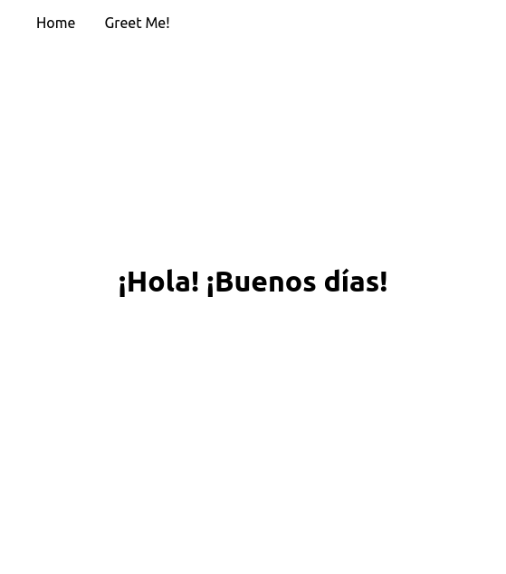

<p align="center">
  <a href="https://www.microverse.org/">
    
  </a>
  <a href="https://github.com/enionsouza/hello-react-front-end">
    
  </a>
  <a href="https://github.com/enionsouza/hello-react-front-end">
    
  </a>
</p>

# Hello React (Front-End)!

## About

The main goals for this exercise are:

- Implement a connection between a Ruby on Rails back-end and ReactJS front-end.
- Understand the pros and cons of different approaches of connecting Ruby on Rails back-end with ReactJS front-end.

In this project, only the ReactJS front-end part was implemented. The back-end part of the project can be found in [this repo](https://github.com/enionsouza/hello-rails-back-end/).

Below, a screenshot of the app is presented:

<p align="center">

</p>

## Built With

- ReactJS, Redux
- VisualStudio Code, Git, & GitHub

## Pre-requisites

- NodeJs (v. 14.17)
- YarnJs (v. 1.22.10)
- Git

## Getting Started

1. In your terminal, in the folder of your preference, type the following bash command to clone this repository:

```sh
git clone git@github.com:enionsouza/hello-react-front-end.git
```

2. Now that you have already cloned the repo run the following commands to get the project up and running:

```sh
cd hello-react-front-end
yarn
npx browserslist@latest --update-db
```

3. Now, on your terminal, run:

```sh
yarn start
```

This should start your local server in [http://localhost:3000/](http://localhost:3000/). Now, you can go to your browser and visit this page, but for this app to execute properly, you need to set up the back-end part (API) which can be found in [this repo](https://github.com/enionsouza/hello-rails-back-end/).

To stop the server, hit `<CTRL> + C` on your keyboard.

## Author

👤 **Ênio Neves de Souza**

- GitHub: [@enionsouza](https://github.com/enionsouza)
- Twitter: [@enionsouza](https://twitter.com/enionsouza)
- LinkedIn: [Enio Neves de Souza](https://www.linkedin.com/in/enio-neves-de-souza/)

## 🤝 Contributing

Contributions, issues, and feature requests are welcome!

Feel free to check the [issues page](https://github.com/enionsouza/hello-react-front-end/issues).

## Show your support

Give a ⭐️ if you like this project!

## 📝 License

This project is [MIT](./LICENSE) licensed.
